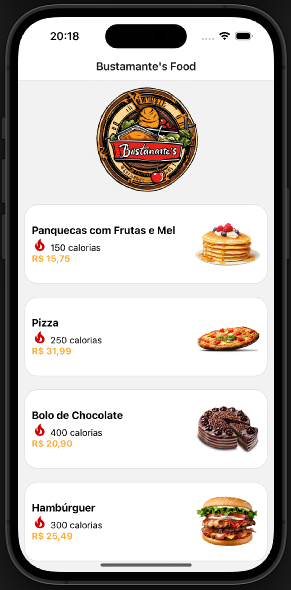

# SENAC - Programação Para Dispositivos Móveis

Este projeto é um aplicativo simples criado usando React Native, desenvolvido como parte de um trabalho acadêmico, que simula um aplicativo de cardápio de restaurante. Por favor, leia atentamente as instruções abaixo para garantir uma experiência suave durante a execução do projeto.

<div style="display: flex;">
  
  
</div>


## Como Executar o Projeto

Para executar este projeto em seu ambiente local, siga as etapas abaixo:

1. **Baixe o Código:**
   Faça o download do código-fonte do projeto e descompacte-o em um diretório de sua escolha.

2. **Abra o Terminal:**
   Abra um terminal ou prompt de comando e navegue até a pasta onde você descompactou o código do projeto.

3. **Instale as Dependências:**
   Para instalar as dependências necessárias, execute o seguinte comando no terminal:

   ```
   npm install
   ```

   Isso instalará todas as bibliotecas e pacotes necessários para a execução do projeto.


4. **Execute o Projeto:**
   Agora que todas as dependências estão instaladas, inicie o projeto com o seguinte comando:

   ```
   npm start
   ```

   Agora basta escolher onde o projeto será compilado
   

Agora você pode explorar aplicativo.
